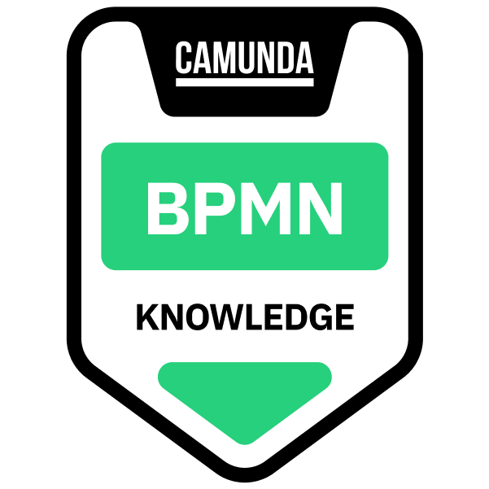

# Digitaler Leistungsantrag in der GKV – BPMN 2.0 \& Camunda 8

<a href="https://www.credly.com/badges/6c178145-c9fc-41f1-8b55-721d4f2d8ac2/public\_url">
  
</a>

Portfolio-Projekt zur Analyse und Digitalisierung eines Leistungsantrags bei einer gesetzlichen Krankenversicherung – vom Ist-Prozess bis zum ausführbaren, fristensicheren Soll-Prozess in Camunda 8.

## Ausgangslage

Leistungsanträge (z. B. häusliche Krankenpflege oder Hilfsmittel zur Krankenbehandlung) werden häufig noch teilweise papierbasiert und manuell bearbeitet. Gleichzeitig gelten gesetzliche Entscheidungsfristen mit harter Rechtsfolge:

|Regel (§ 13 Abs. 3a SGB V)|Inhalt|
|-|-|
|Entscheidungsfrist|3 Wochen nach Antragseingang|
|Mit Gutachten des Medizinischen Dienstes|5 Wochen – Versicherter muss darüber informiert werden|
|Fristüberschreitung ohne Begründung|Leistung gilt als genehmigt (Genehmigungsfiktion)|

**Ziel:** Den Prozess so zu gestalten, dass Fristen automatisch überwacht, Routinefälle regelbasiert entschieden und Bescheide digital erzeugt werden.

**Abgrenzung:** Hilfsmittel zum Behinderungsausgleich fallen unter § 18 SGB IX (2-Monats-Frist) und sind bewusst nicht Teil dieses Modells.

## Projektstufen

|Stufe|Inhalt|Status|
|-|-|-|
|1. Ist/Soll|Ist-Prozess und digitaler Soll-Prozess als Collaboration (Versicherter, Krankenkasse, Medizinischer Dienst, Leistungserbringer)|🔄 in Arbeit|
|2. Ausführbar|Camunda Forms für Antrag und Sachbearbeitung, DMN-Entscheidungstabelle („Gutachten erforderlich?“)|⏳ geplant|
|3. Automatisiert|Fristüberwachung per Timer, Zwischenmitteilung, Nachforderung von Unterlagen, automatischer Bescheid|⏳ geplant|
|4. Auswertung|Kennzahlen (Durchlaufzeit, Fristquote, Automatisierungsgrad) im Ist/Soll-Vergleich|⏳ geplant|

## Repository-Struktur

```
├── models/      BPMN-, DMN- und Form-Dateien
├── docs/        Screenshots, Badge, Dokumentation
└── README.md
```

## Technik

* BPMN 2.0, DMN
* Camunda 8 (Modeler, Forms, Zeebe Engine)
* Lokale Ausführung über Docker Compose (Camunda 8 Self-Managed)

## Hinweis

Fiktives Lernprojekt ohne echte Versichertendaten. Die rechtlichen Rahmenbedingungen dienen als fachliche Grundlage der Modellierung und stellen keine Rechtsberatung dar.

