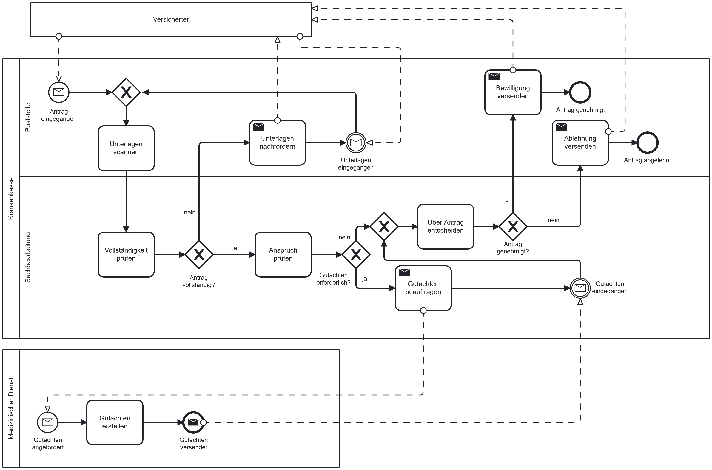
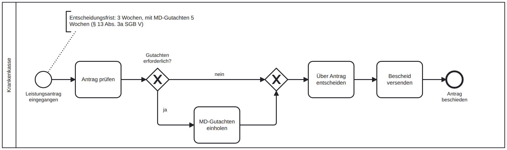
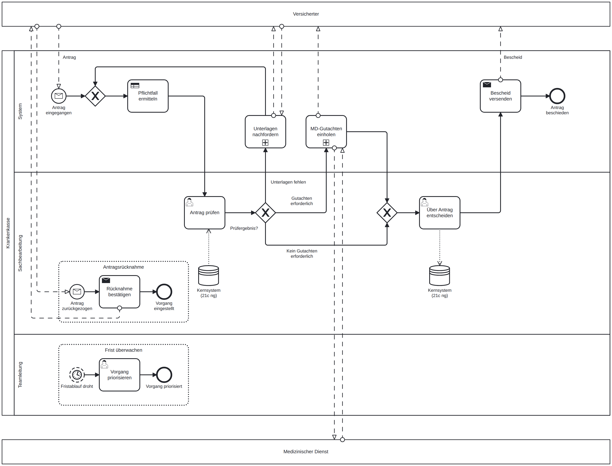
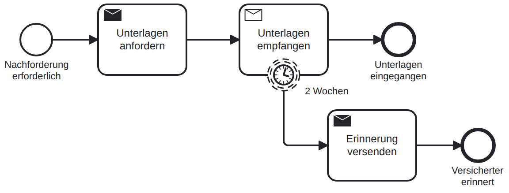
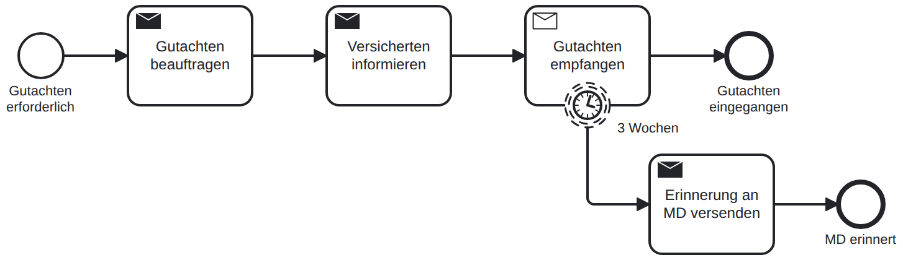

# Digitaler Leistungsantrag in der GKV (BPMN 2.0 / Camunda 8)

In diesem Projekt habe ich mir angeschaut, wie ein Leistungsantrag bei einer Krankenkasse bearbeitet wird, und den Ablauf mit BPMN neu gedacht. Ausgangspunkt war die Frage, wie man so einen Prozess digitalisieren kann, ohne dass die Fachlichkeit auf der Strecke bleibt.

Spannend fand ich vor allem die gesetzlichen Fristen. Nach § 13 Abs. 3a SGB V muss die Kasse innerhalb von drei Wochen entscheiden, mit Gutachten des Medizinischen Dienstes innerhalb von fünf. Wird die Frist ohne Begründung überschritten, gilt die Leistung als genehmigt. Ein Prozess, der Fristen nicht im Blick hat, ist hier also ein echtes Risiko.

## Projektstand

- [x] Ist-Prozess modelliert und Schwachstellen analysiert
- [x] Soll-Prozess entworfen (strategisch und operativ)
- [ ] Prozess in Camunda 8 ausführbar machen (Formulare, DMN, Nachrichten)
- [ ] Kennzahlen im Ist/Soll-Vergleich auswerten

## Ist-Prozess

So läuft die Bearbeitung typischerweise ab, wenn noch viel auf Papier passiert: Der Antrag kommt per Post, wird gescannt, geprüft, bei Bedarf geht er zum Medizinischen Dienst, dann wird entschieden.

Beim Modellieren sind mir vor allem diese Punkte aufgefallen:

- Niemand überwacht die Entscheidungsfrist.
- Wird der Medizinische Dienst eingeschaltet, erfährt der Versicherte davon nichts. Dadurch gilt eigentlich weiter die kürzere Frist.
- Auf fehlende Unterlagen oder das Gutachten wird gewartet, ohne nachzuhaken.
- Jede Nachreichung läuft wieder über Post und Scanner.
- Ob ein Gutachten nötig ist, entscheidet jeder Sachbearbeiter für sich.
- Bescheide werden von Hand erstellt.

## Soll-Prozess

### Überblick

Die grobe Sicht für alle, die nur wissen wollen, was passiert, nicht wie.

### Detaillierter Ablauf

Hier sieht man, wer was macht. Alles in der Lane „System“ übernimmt die Process Engine, Menschen kommen nur noch dort ins Spiel, wo wirklich eine fachliche Einschätzung gebraucht wird. Die beiden Kommunikationsschleifen (Unterlagen nachfordern, Gutachten einholen) habe ich in Unterprozesse ausgelagert, damit das Hauptmodell lesbar bleibt:

### Was sich gegenüber dem Ist-Prozess ändert

| Problem im Ist-Prozess | Lösung im Soll-Prozess |
|---|---|
| Frist wird nicht überwacht | Ein Timer meldet sich vor Fristablauf, die Teamleitung priorisiert den Vorgang |
| Versicherter wird bei MD-Gutachten nicht informiert | Direkt nach dem Gutachtenauftrag geht automatisch eine Information raus |
| Warten ohne Nachhaken | Nach 14 bzw. 21 Tagen wird automatisch erinnert |
| Post und Scannen | Der Antrag kommt digital rein |
| Gutachtenbedarf uneinheitlich | Gesetzliche Pflichtfälle erkennt eine Entscheidungstabelle (DMN), alle anderen Fälle prüft weiterhin ein Sachbearbeiter |
| Bescheide von Hand | Der Bescheid wird automatisch aus einer Vorlage erzeugt |

Eine Sache war mir beim Gutachten wichtig: Das System kann nur sicher sagen, wann ein Gutachten **gesetzlich vorgeschrieben** ist. Ob es darüber hinaus nötig ist (§ 275 Abs. 1 SGB V), ist eine Ermessensfrage. Deshalb entscheidet das System hier nie „kein Gutachten“, sondern legt diese Fälle dem Sachbearbeiter vor.

Bewusst nicht modelliert habe ich das Widerspruchsverfahren und Hilfsmittel zum Behinderungsausgleich, für die eigene Fristen gelten.

## Dateien

| Datei | Inhalt |
|---|---|
| [`models/ist-leistungsantrag.bpmn`](models/ist-leistungsantrag.bpmn) | Ist-Prozess |
| [`models/strategisch-leistungsantrag.bpmn`](models/strategisch-leistungsantrag.bpmn) | Strategischer Überblick |
| [`models/soll-leistungsantrag.bpmn`](models/soll-leistungsantrag.bpmn) | Operativer Soll-Prozess (Camunda 8) |

Die Modelle lassen sich mit dem Camunda Desktop Modeler öffnen.

*Fiktives Lernprojekt ohne echte Daten.*
